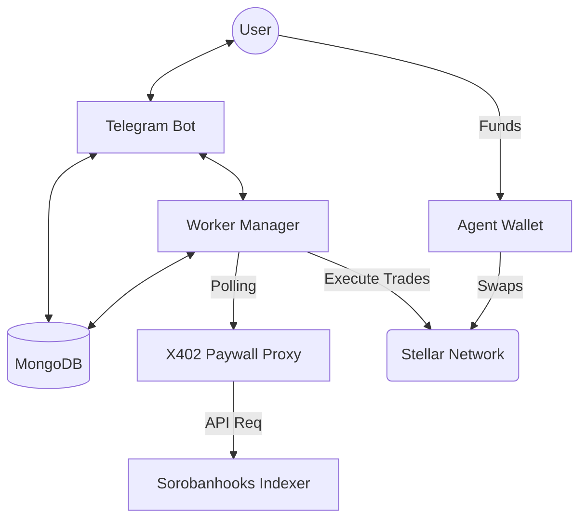

# X402 Proxy Agent: System Architecture & Flow

This document provides a detailed explanation of the logic and data flow within the X402 Proxy Agent system.

## 🏗 High-Level Architecture

The system is a bridge between the **Stellar Blockchain**, a **Telegram User Interface**, and the **X402 Paywall Protocol**.

---

## 🚦 System Flows

### 1. User Onboarding Flow
1.  **Command**: User runs `/createagent <target_wallet>`.
2.  **Wallet Generation**: The system creates a new Stellar Keypair.
    -   *Testnet*: Automatically funded via Friendbot.
3.  **Trustlines**: The system establishes a USDC trustline for the agent wallet.
4.  **Database**: A new `Agent` record is stored with the encrypted (or stored-as-text) `agentSecret`.
5.  **Initialization**: A dedicated background worker is started for this agent.

### 2. Configuration Flow (`/setrules`)
The bot uses a **State Machine** session to collect trading parameters:
-   **Thresholds**: `buyBelowUsd` and `sellAboveUsd`.
-   **Tiers**:
    -   **Tier 1**: Automatic trades (no user input needed).
    -   **Tier 2**: Confirmation required (via Telegram buttons).
-   **Budgeting**: `dailyBudget` caps the total USDC spent per day.
-   **Amounts**: Exact `buyAmountUsdc` or `sellAmountXlm` per individual trade.

### 3. The Autonomous Polling Loop
Every 30 seconds, the **Worker Manager** performs the following cycle for each active agent:

1.  **Price Discovery**:
    -   The worker calls the internal paywall endpoint (`/api/v1/alerts/XLM`).
    -   The request is signed using the **Agent's Secret**.
    -   The **X402 Middleware** verifies the signature and records a micro-payment.
2.  **Signal Generation**:
    -   If `Current Price <= buyBelowUsd` → **BUY Signal**.
    -   If `Current Price >= sellAboveUsd` → **SELL Signal**.
3.  **Trade Routing**:
    -   Check **Daily Budget**: Has the agent spent too much today?
    -   Check **Wallet Balance**: Does the agent have enough USDC (for buy) or XLM (for sell)?
    -   Determine **Tier**:
        -   Amount <= `tier1Max` → **Auto-Execution**.
        -   Amount > `tier1Max` → **Send Telegram Prompt**.
4.  **Execution**:
    -   Uses Stellar **Path Payments** to swap between XLM and USDC.
    -   1% slippage protection is applied.
    -   Logs success/failure to `AgentLogs`.

---

## 🔐 Security & Safety Mechanisms

### Agent Wallet Revocation
When a user runs `/revokeagent`:
1.  **Stop Worker**: The polling loop for that agent is terminated.
2.  **Drain Assets**: All transferable assets (USDC and XLM) are sent to the user's `target_wallet`.
3.  **Reserve Handling**: It calculates the Stellar minimum reserve (based on trustlines and entries) to prevent transaction failure.
4.  **Disable**: The agent record is marked `active: false` in the DB.

### Low Balance Alerts
-   The worker monitors the agent's USDC balance.
-   If balance falls below the `USDC_LOW_BALANCE_FLOOR` (default 0.05), a Telegram notification is sent.
-   **Cooldown**: Alerts are throttled (default 1 hour) to avoid spamming the user.

### Paywall Monetization
This project implements a unique **"Data-Pay-Data"** model:
-   The core trading data (Price Alerts) is not free.
-   The trading bot itself generates revenue for the data provider (Sorobanhooks) by paying for every price check it performs.
