# Xyra — Detailed System Architecture

> **Audience:** engineers working across the three repos.
> **Scope:** low-level component internals, Mermaid system diagrams, per-flow
> data traces, security boundaries, and demo vs canonical configuration.
>
> **Companion docs:**
> - High-level shape → [`ARCHITECTURE_OVERVIEW.md`](./ARCHITECTURE_OVERVIEW.md)
> - API contracts, auth specs, SCF evidence → [`SCF_TECHNICAL_INTEGRATION.md`](./SCF_TECHNICAL_INTEGRATION.md)
> - Baku API reference → [`../API.md`](../API.md)
>
> **Last reconciled:** 2026-06-08 · Stellar testnet · all three repos merged to
> default branches.

---

## Table of contents

1. [Repository map](#1-repository-map)
2. [Full system diagram — all repos](#2-full-system-diagram--all-repos)
3. [Component 1 — Smart contracts (`crates/`)](#3-component-1--smart-contracts-crates)
4. [Component 2 — Baku API (`api/`)](#4-component-2--baku-api-api)
5. [Component 3 — Browser extension (`xyra-wallet-sdk`)](#5-component-3--browser-extension-xyra-wallet-sdk)
6. [Component 4 — Agent backend (`xyra-walllet`)](#6-component-4--agent-backend-xyra-walllet)
7. [End-to-end data flows](#7-end-to-end-data-flows)
8. [Security boundaries](#8-security-boundaries)
9. [External services](#9-external-services)
10. [Demo vs canonical configuration](#10-demo-vs-canonical-configuration)
11. [Testnet address book](#11-testnet-address-book)

---

## 1. Repository map

| # | Repo | Path / branch | Deployable unit | Holds a key? |
|---|------|---------------|-----------------|--------------|
| 1a | **xyra-vault** — contracts | `palmyra/crates/` · `main` | Rust → wasm32, deployed to Soroban | No |
| 1b | **xyra-vault** — Baku API | `palmyra/api/` · `main` | Docker · Bun 1.3-alpine · `:8787` | No |
| 2 | **xyra-walllet** | `SaaS-Repo/xyra-walllet` · `master` | Docker · Node/Express · `:3000` | Yes — per-user agent key (encrypted) |
| 3 | **xyra-wallet-sdk** | `Blockchain-AI-Apps/xyra-wallet-sdk` · `main` | Chrome Extension MV3 | Yes — user key (in-memory, background worker only) |

Repos 1a and 1b share a git repository (`xyra-vault`) but are distinct deployable
units with independent lifecycles. The address book is the only shared artifact
and is manually promoted (intentionally auditable — see §4.3).

---

## 2. Full system diagram — all repos

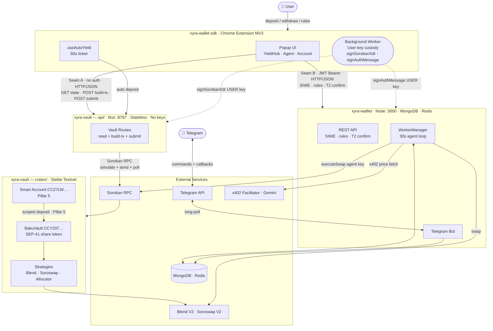

---

## 3. Component 1 — Smart contracts (`crates/`)

### Role

The on-chain tier. Custodies all deposited funds through the vault + strategy
pattern. The vault IS the share token; strategies hold the underlying at external
protocols. No admin key can move user funds unilaterally — the vault only moves
funds to/from the registered active strategy, and users redeem their own shares.

### Workspace layout

```
crates/
├── addresses/          Canonical contract address book (Rust). Manually mirrored to api/src/addresses.ts.
├── strategy-trait/     #[contractclient] Strategy trait. All strategies implement this interface.
├── mock-strategy/      MockStrategy — unit tests + demo inject_yield.
├── vault/              BakuVault — OZ Vault composition. IS the SEP-41 bkuXLM/bkuUSDC share token.
├── blend-strategy/     BlendStrategy — live lending via blend-contract-sdk.
├── soroswap-strategy/  SoroswapStrategy — swap-and-hold (Soroswap V2 XLM/USDC pair).
├── defindex-strategy/  DeFindex adapter — registered on vault-usdc, currently inactive.
├── sa-account/         OZ Stellar Smart Account + Ed25519 verifier (Pillar 5).
└── sa-tracer/          Auth-digest shape/parity tracer (validation-only; no product logic).
```

### Vault contract — share math

```
VIRTUAL_SHARES = 1_000_000   (OZ ERC-4626 virtual offset, 7-decimal scale)
VIRTUAL_ASSETS = 1

deposit_shares = assets × (total_supply + VIRTUAL_SHARES)
                         ─────────────────────────────────
                         (total_assets + VIRTUAL_ASSETS)

redeem_assets  = shares × (total_assets + VIRTUAL_ASSETS)
                         ─────────────────────────────────
                         (total_supply + VIRTUAL_SHARES)
```

`total_assets` = `strategy.current_value()`, not the vault's own token balance
(which is always ~0 — funds flow depositor → strategy directly).

### Strategy trait (all strategies implement)

```rust
deposit(vault: Address, amount: i128) → Result<(), StrategyError>
withdraw(vault: Address, amount: i128) → Result<i128, StrategyError>
current_value() → i128
harvest(vault: Address) → Result<i128, StrategyError>
pool_apy() → u32
set_pool_apy_bps(admin: Address, bps: u32) → Result<(), StrategyError>
```

### Deployed strategies

| Strategy | Contract | Status | Protocol |
|----------|----------|--------|----------|
| BlendStrategy-XLM | `CAGIMEB3…` | **Active** | Blend V2 single-asset XLM lending |
| BlendStrategy-USDC | `CDVPZOJTAP…` | Active | Blend V2 USDC lending |
| SoroswapStrategy-XLM | `CA4SKYV4…` | Registered | Soroswap V2 XLM/Circle-USDC LP |
| DeFindex-USDC | `CDXUHZ2F…` | Registered | DeFindex adapter → Blend USDC |
| Allocator | via `BAKU_TESTNET_ALLOCATOR_XLM` | Demo vault only | Meta-allocator (30/40/30) |

### Weighted meta-allocator (demo vault)

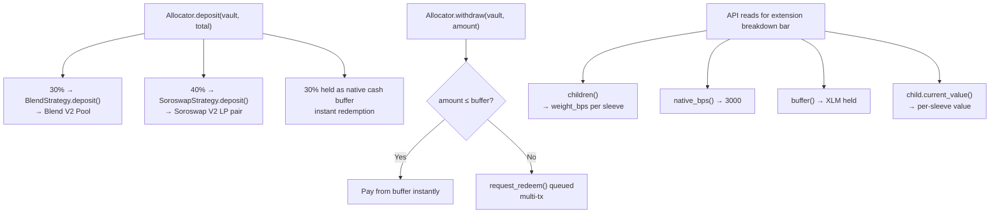

### Smart Account — Pillar 5

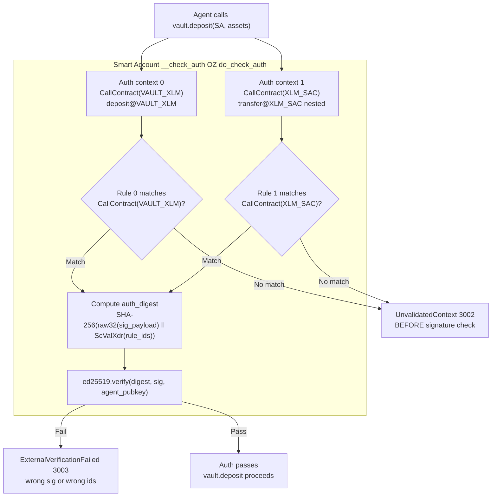

Parity proof commands:
```bash
cargo test -p sa-tracer digest_reference   # writes digest_vectors.json (Rust ground truth)
bun run tracer:digest-parity               # TS ≡ Rust for all 6 adversarial vectors
```

---

## 4. Component 2 — Baku API (`api/`)

### Role

A **stateless, key-less read/build server**. It translates HTTP requests from the
extension into Soroban RPC simulations (reads) and unsigned transaction XDR
(build-tx). It never holds a private key and cannot initiate transfers. The only
secrets it uses are operational (RPC URL, network passphrase) — nothing that can
move funds.

### Architecture

```
src/index.ts            Hono app · CORS middleware (permissive, tighten for prod)
src/addresses.ts        Canonical NetworkAddresses · env override for demo vault
src/routes/
  vault.ts              /vault/:asset/* — state reads + build-tx
  balance.ts            /balance/:address — aggregated balances
  submit.ts             /tx/submit — relay signed XDR to RPC, poll result
src/rpc.ts              simulateRead / buildInvocationXdr / addrScVal / i128ScVal
src/cache.ts            TtlCache<T> — generic in-memory TTL cache
```

### Endpoint map

| Method | Path | Body | Response |
|--------|------|------|----------|
| `GET` | `/health` | — | `{ ok, t }` |
| `GET` | `/addresses` | — | `NetworkAddresses` (env-resolved) |
| `GET` | `/vault/:asset/state` | — | TVL + APY + pps + breakdown + strategyPositions |
| `GET` | `/vault/:asset/strategies` | — | registry + active marker |
| `POST` | `/vault/:asset/deposit/build-tx` | `{ user, amount }` | `{ xdr }` |
| `POST` | `/vault/:asset/withdraw/build-tx` | `{ user, shares, max_slippage_bps }` | `{ xdr, preview }` |
| `POST` | `/tx/submit` | `{ signed_xdr }` | `{ hash, status, returnValue }` |
| `GET` | `/balance/:address` | — | `{ stxlm, stusdc, xlm, usdc }` |
| `POST` | `/faucet/blend-testnet` | `{ userId }` | partially-signed classic XDR |

### `/vault/:asset/state` read fan-out

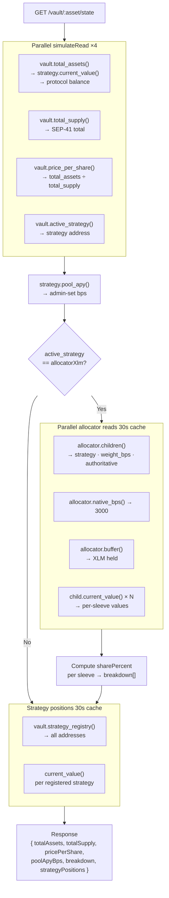

### Caching strategy

| Cache key | TTL | Content |
|-----------|-----|---------|
| `{net}:{asset}:breakdown` | 30s | Per-sleeve allocator breakdown |
| `{net}:{asset}` | 30s | Strategy position list |
| balance (per address) | 3s | stXLM/stUSDC/XLM/USDC balances |

### Address resolution + demo override

```typescript
// api/src/addresses.ts
TESTNET.allocatorXlm = ""  // empty on canonical vault

// api/.env.demo sets:
BAKU_TESTNET_VAULT_XLM=<demo vault address>
BAKU_TESTNET_ALLOCATOR_XLM=<allocator address>

// applyEnvOverrides() merges at runtime — canonical addresses unchanged
```

---

## 5. Component 3 — Browser extension (`xyra-wallet-sdk`)

### Role

The **only component that holds the user's private key**. All transaction signing
and auth-message signing happens inside the **background service worker**, which
is isolated from the popup and never exposes the raw key to any script. Both
backends are called from the popup, but only unsigned data crosses the popup↔worker
boundary.

### Runtime parts

```
popup/                  React 19 UI — all views, Redux state, API service calls
background.ts           Service worker — key custody + signing entry points
content.ts              Content script (<all_urls>) — inpage Freighter API
```

### Key signing paths (background worker only)

| Call | Signing primitive | Used for |
|------|-------------------|---------|
| `signSorobanXdr(xdr)` | Ed25519 · Soroban XDR | Vault deposit/redeem transactions |
| `signAuthMessage(msg)` | Ed25519 · SEP-53 `sha256("Stellar Signed Message:\n"+msg)` | SIWE challenge for agent backend |
| `signFreighterTransaction(xdr)` | Ed25519 · Classic XDR | Faucet co-sign, classic TXs |

### YieldHub tab — deposit and withdraw flows

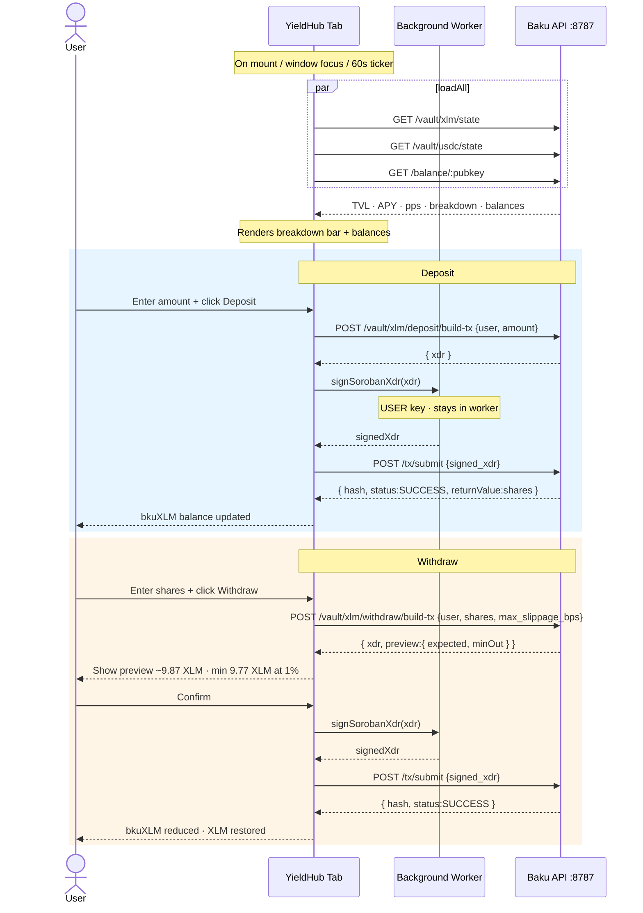

### Auto-yield (useAutoYield.ts)

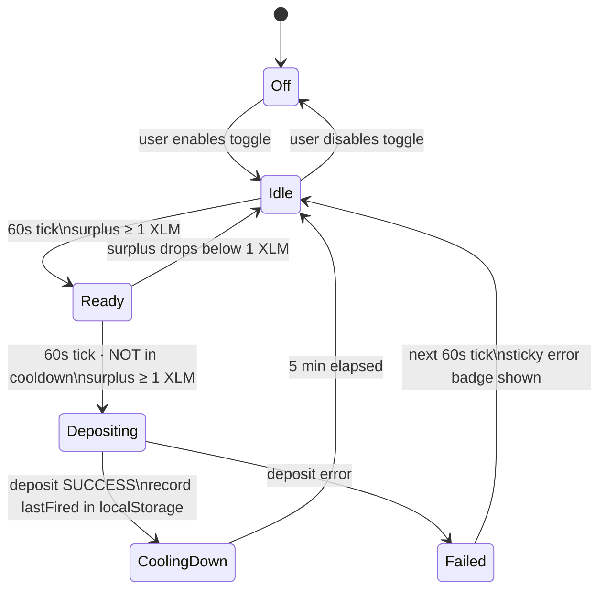

### Direction-C tab — Tier-2 confirm flow

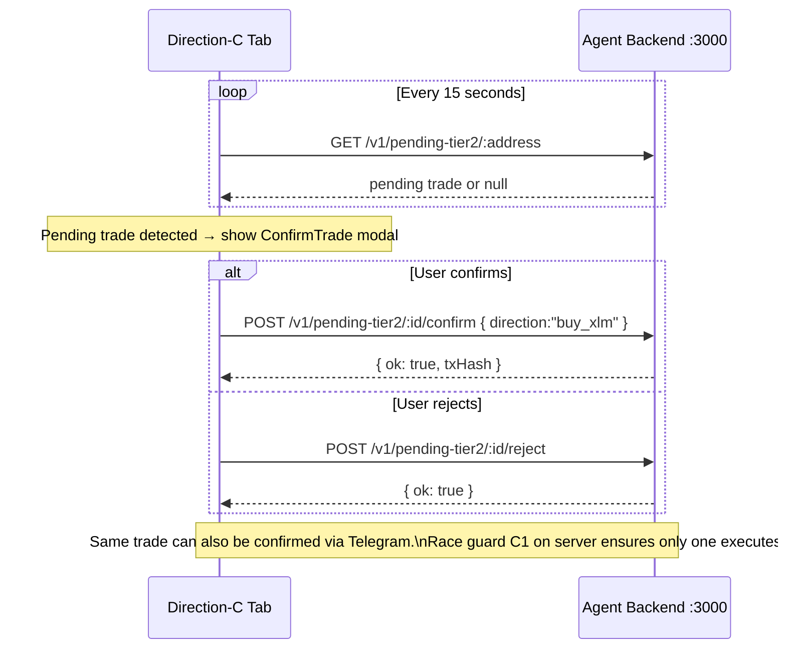

---

## 6. Component 4 — Agent backend (`xyra-walllet`)

### Role

The **stateful, secret-holding middle tier**. It runs autonomous trading loops
for each user's agent, manages encrypted agent keys, provides a Telegram bot
interface, serves AI-narrated trade history, and gates premium data behind x402
micropayments. It never holds the user's key — only a per-user throwaway agent key
under envelope encryption.

### Architecture

```
src/index.ts              Express app · x402 middleware mount · startup init
src/config.ts             Fail-closed env validation (exit(1) on missing required vars)
src/routes/
  v1.ts                   All /v1/* endpoints
  alerts.ts               x402-paywalled price alert handler
  enriched.ts             Alert enrichment
  insight.ts              AI insight
src/middleware/
  require-auth.ts         JWT Bearer verification + ownership check
  x402.ts                 Legacy x402 middleware
src/services/
  bot.ts                  Telegram bot (Telegraf)
  worker-manager.ts       30s agent polling loop
  trade-routing.ts        Tier 1/2 routing logic
  stellar-service.ts      Stellar swap execution
  agent-secret-crypto.ts  AES-256-GCM envelope encryption
  x402-client.ts          x402 fetch client (agent pays for price data)
  auth.ts                 SIWE challenge/verify
  db.ts                   MongoDB models (Agent, AgentLog)
  redis.ts                Redis price cache
  narrate-log-ai.ts       Gemini trade narration
  explain-rules-ai.ts     Gemini rule explanation
  contract-summary-ai.ts  Gemini WASM analysis
  daily-spend.ts          UTC-day budget tracking
  pending-tier2.ts        In-memory Tier-2 queue
```

### x402 micropayment flow

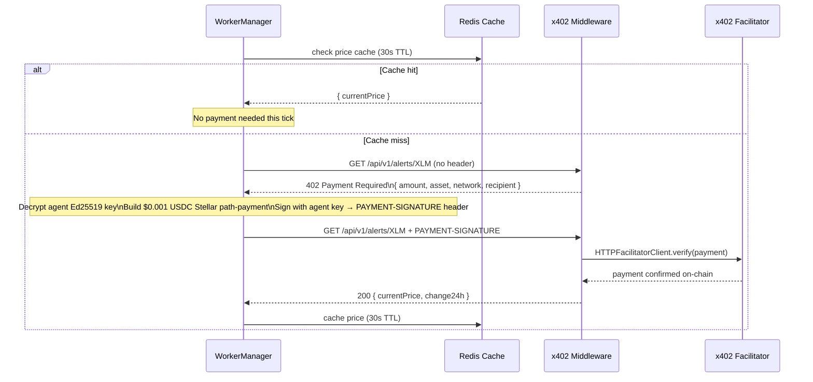

### Worker loop — full decision tree

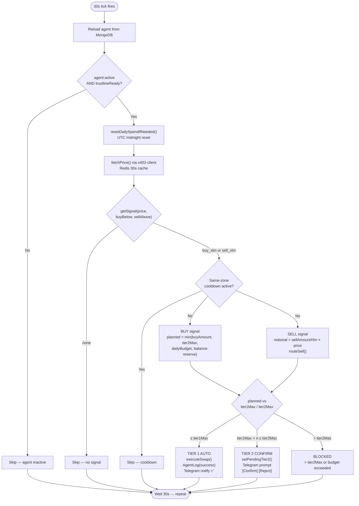

### Tier-2 dual-confirm race guard

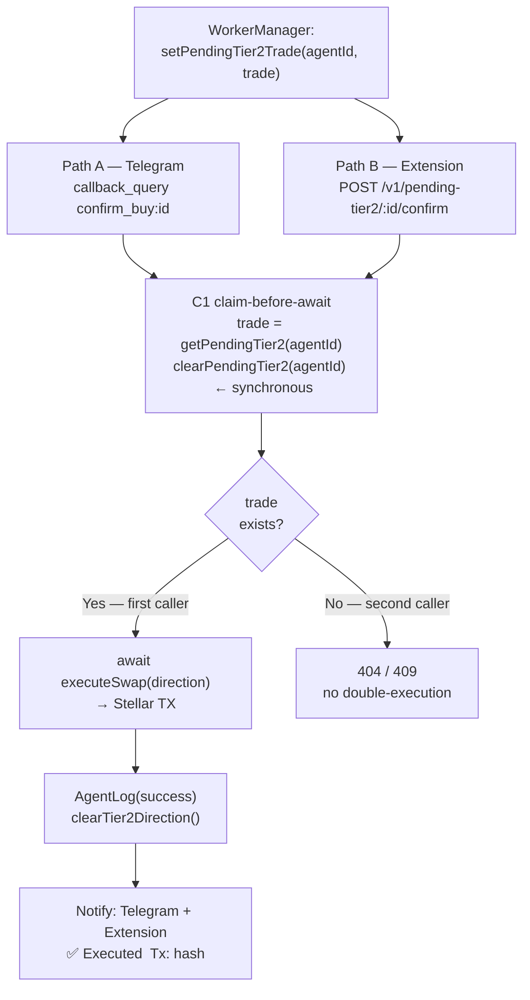

### Agent key lifecycle

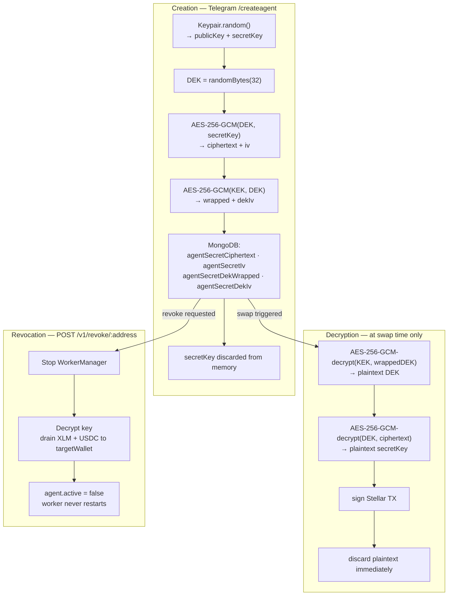

### Telegram bot commands

| Command / callback | Action |
|--------------------|--------|
| `/createagent <target>` | Generate agent keypair, encrypt, store in Mongo |
| `/createtrustline` | Setup USDC trustline on Stellar, start worker |
| `/setrules` | Multi-step conversation: buyBelow · sellAbove · tier1Max · tier2Max · dailyBudget · sellAmountXlm · buyAmountUsdc |
| `/status` | Balances + rules + worker state |
| `/agentlog` | Last 5 trade entries |
| `/revokeagent` | Drain + disable |
| `confirm_buy:id` | Execute queued Tier-2 buy (claim-before-await) |
| `confirm_sell:id` | Execute queued Tier-2 sell |
| `reject_trade:id` | Discard pending trade |

---

## 7. End-to-end data flows

### 7.1 Deposit — XLM into vault

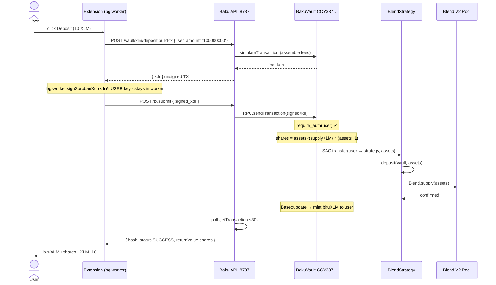

### 7.2 Withdraw — redeem bkuXLM shares

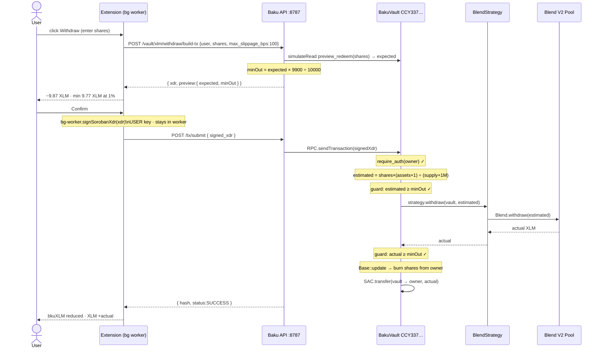

### 7.3 Agent trade — Tier-1 auto-execute

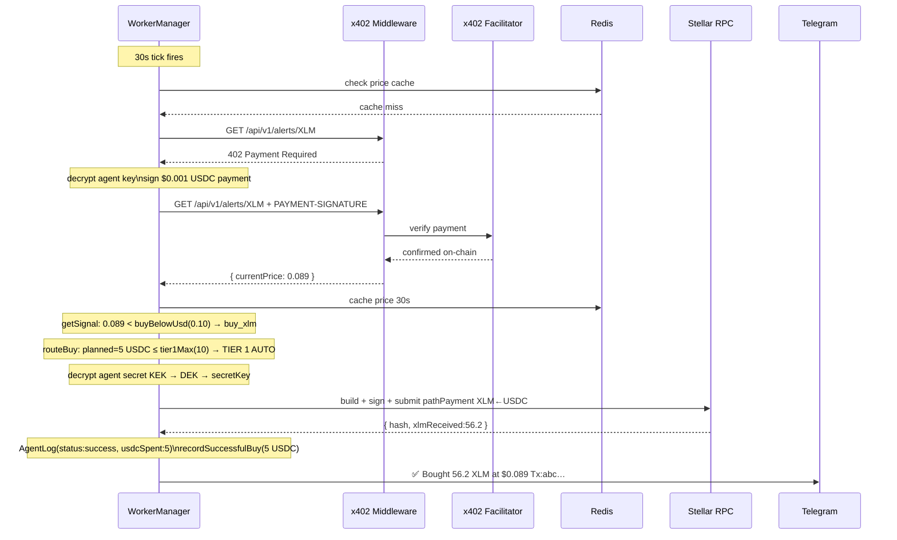

### 7.4 Agent trade — Tier-2 human-confirm (dual path)

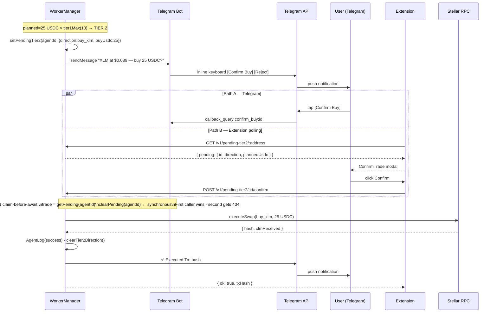

---

## 8. Security boundaries

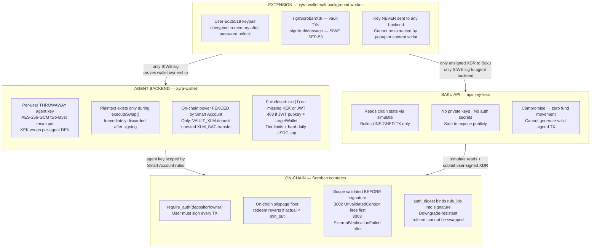

---

## 9. External services

| Service | Used by | Purpose |
|---------|---------|---------|
| `soroban-testnet.stellar.org` | Baku API + agent backend | Soroban RPC (simulate + send + poll) |
| Telegram Bot API | agent backend · `bot.ts` | Long-poll for commands + callback confirms |
| X402 Facilitator | agent backend · `x402-client.ts` | Verify USDC micropayments for paywalled data |
| Sorobanhooks Indexer | agent backend · `sorobanhooks.ts` | Upstream token price / alert data |
| Gemini API | agent backend · `narrate-log-ai.ts` etc. | Trade narration, rule explanation, WASM analysis |
| MongoDB | agent backend | Agent config, AgentLog, contract summary cache |
| Redis | agent backend | XLM price cache (30s TTL) |
| Blend V2 Pool `CCEBVDYM…` | BlendStrategy | supply / withdraw / balance — earns BLND rewards |
| Soroswap V2 Router `CCJUD55A…` | SoroswapStrategy + agent swaps | add/remove liquidity · XLM↔USDC swaps |

---

## 10. Demo vs canonical configuration

| | Canonical (default) | Demo (`.env.demo`) |
|-|---------------------|--------------------|
| Vault | `CCY337D4WZ6…` (BlendStrategy active) | Separate demo vault (allocator active) |
| Active strategy | BlendStrategy `CAGIMEB3…` | Allocator (30/40/30) |
| Breakdown bar | `null` (single strategy) | `[{Blend,30%},{Soroswap,40%},{Native,30%}]` |
| Instant withdraw | Always | Only ≤ native buffer |
| Large withdraw | Immediate | Queued multi-tx |
| APY display | Blend lending rate | Blended 3.5% (admin-set) |

**Switch to demo:**
```bash
cp api/.env.demo api/.env && docker compose up -d
```
**Revert to canonical:**
```bash
rm api/.env && docker compose up -d
```

---

## 11. Testnet address book

Network: `Test SDF Network ; September 2015` · RPC `https://soroban-testnet.stellar.org`

**Mainnet: nothing deployed — all placeholders, gated on audit + SCF funding.**

| Contract | Address |
|----------|---------|
| vault-xlm v2 (canonical) | `CCY337D4WZ6OECCTQMWIMWT2CHBC73YY5JFRKBJ665O654KMUG3CP7YH` |
| vault-xlm v1 (legacy, redeem-only) | `CCDEEXUU25RUOZVSYCSJPX35QKPZTDBAT6UFW6GTC633LV3TLOXMDOLD` |
| vault-usdc | `CDEOKPUFZT7XL5XITZWUTVD2VBU2NDEVA5EL7XXLMKP6INML4EHIEXNL` |
| BlendStrategy-XLM (active) | `CAGIMEB3MLO6AV5F2WZXGOI6KEQ7MNWA4TKOORP5IGDSTIR7UBRCKBUJ` |
| BlendStrategy-USDC (active) | `CDVPZOJTAP5X2XLRYWSLFCRKE5KNV4ZMPWB6NPSGWWT3YKSTQTM5YFSG` |
| SoroswapStrategy-XLM (registered) | `CA4SKYV4O34KJA7TEA36GRDZJK3OZ2FN6QON4QDRA27V7RMPLJTGQHOS` |
| DeFindex-USDC (registered) | `CDXUHZ2FHLEV6G5YRUYNWKXMNGJUSHELYLQ2LOZRCGTJ6ZFMC2Z2YEAY` |
| Smart Account (hardened) | `CCZ7LWLZ67GSVYZNICUCIZJBQG4KDE4KVPX7C6E2M2WCOPJUQ5HTJXE4` |
| Ed25519 verifier (hardened) | `CBXBHFARMU5GOMDZV3XWPEZJY2NDUEHO6L6DAZNCDQCKZNAL26KPBP4V` |
| Native XLM SAC | `CDLZFC3SYJYDZT7K67VZ75HPJVIEUVNIXF47ZG2FB2RMQQVU2HHGCYSC` |
| Circle USDC SAC (Soroswap pairs) | `CBIELTK6YBZJU5UP2WWQEUCYKLPU6AUNZ2BQ4WWFEIE3USCIHMXQDAMA` |
| Blend USDC SAC (Blend pool) | `CAQCFVLOBK5GIULPNZRGATJJMIZL5BSP7X5YJVMGCPTUEPFM4AVSRCJU` |
| Blend V2 pool | `CCEBVDYM32YNYCVNRXQKDFFPISJJCV557CDZEIRBEE4NCV4KHPQ44HGF` |
| Soroswap V2 router | `CCJUD55AG6W5HAI5LRVNKAE5WDP5XGZBUDS5WNTIVDU7O264UZZE7BRD` |
| Soroswap XLM/Circle-USDC pair | `CCBX3NZTCQLQFSPG7HBOKL4P2RVPOPVFHDNRTOSCCJWBTPL2GHEH7RQS` |
| Admin / deployer (G-account) | `GCWHACNPCEV6FPANBP3WMHFSR3LXMZO5CNIZNEKEKV7PAM2TBJ5HEVTV` |
